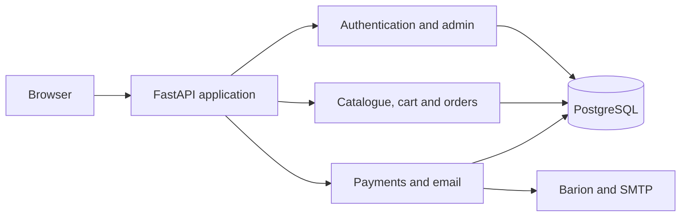

# Mesencsi

**A production-oriented webshop and digital storybook platform built for a real Hungarian children's-book client.**


Mesencsi combines a public storefront, customer accounts, physical and digital products, a custom storybook reader, an administration interface, order management, shipping rules and Barion payment integration in one application.

This repository is published as a portfolio and technical review artifact. Production credentials and customer data are not included.

## What this project demonstrates

- End-to-end backend ownership with **Python, FastAPI, PostgreSQL, SQLAlchemy and Alembic**
- Authentication and authorization for customers, administrators and maintenance users
- Server-authoritative pricing, discounts, shipping and order validation
- Defensive payment workflows with Barion status verification and idempotent callbacks
- A structured email outbox for reliable transactional email delivery
- Production configuration validation, security headers, rate limiting and health checks
- Automated backend, frontend characterization and Playwright end-to-end testing
- Deployment and handover documentation for an application built for a real client

## Main features

| Area | Highlights |
| --- | --- |
| Storefront | Product catalogue, cart, guest checkout, registered customer accounts and Hungarian address validation |
| Digital storybooks | Admin editor, configurable page layouts and a public spread-based reader |
| Payments | Barion Payment/Start, GetPaymentState verification, IPN handling, retry protection and payment-attempt history |
| Orders and shipping | Server-side totals, coupons, bundle discounts, personal pickup and GLS pricing |
| Content | Gallery, news posts, comments and featured content |
| Administration | Products, orders, users, discounts, gallery, news and storybook management |
| Email | Verification, password reset and payment confirmation through an outbox worker |
| Operations | Alembic migrations, health and metrics hooks, deployment checks and incident-oriented logging |

## Architecture



The backend serves both the API and the static storefront/admin interface from a single origin. Business-critical values such as prices, discounts, shipping fees and payment status are recalculated or verified on the server instead of trusting the browser.

## Quality and safety

- **347 automated backend tests**
- Playwright suites for public pages, authentication, shopping, content and admin workflows
- Separate secrets and token handling for customer and administrator authentication
- CSRF protection on mutating routes and rate limiting around sensitive operations
- Password-reset and account-state changes invalidate existing sessions through token versioning
- Order and payment operations use idempotency protections
- Production startup validation rejects unsafe or incomplete configuration
- OpenAPI documentation is disabled in production mode

The project intentionally keeps launch gates explicit. Live payment approval, SMTP verification, infrastructure configuration and final owner acceptance are treated separately from code completion.

## Technology stack

| Layer | Technology |
| --- | --- |
| Backend | Python, FastAPI, Uvicorn, Pydantic |
| Data | PostgreSQL, SQLAlchemy 2, Alembic |
| Frontend | HTML, CSS and modular vanilla JavaScript |
| Payments | Barion REST API and IPN callbacks |
| Email | SMTP with a database-backed outbox worker |
| Testing | Pytest and Playwright |
| Operations | Docker Compose, Render staging configuration, health checks and deployment scripts |

## Repository structure

```text
project/
├── backend/       FastAPI application, migrations, tests and operational scripts
├── frontend/      Storefront, administration interface and storybook reader
├── e2e/           Playwright end-to-end tests
├── docs/          Compliance and audit notes
├── PORTFOLIO.md   Detailed technical case study
└── HANDOVER.md    Reviewer and developer handover guide
```

## Run locally

The most direct Windows setup is:

```powershell
cd project\backend
copy .env.example .env
# Configure PostgreSQL, JWT secrets and owner credentials in .env
docker compose up -d
.\run.bat
```

The application then serves the storefront at `http://127.0.0.1:8000/`, the admin login at `/admin/login`, the development API documentation at `/docs`, and the health endpoint at `/health`.

Run the automated gates from `project/backend/`:

```powershell
.\scripts\gate_pytest.ps1
.\scripts\gate_full.ps1
python scripts\predeploy_alembic_check.py
```

See the [backend quick start](project/backend/README.md) and [development guide](project/backend/docs/DEVELOPMENT.md) for full setup details.

## Documentation

- [Detailed portfolio case study](project/PORTFOLIO.md)
- [Architecture](project/backend/docs/ARCHITECTURE.md)
- [API reference](project/backend/docs/API.md)
- [Environment variables](project/backend/docs/ENVIRONMENT.md)
- [Handover and review guide](project/HANDOVER.md)
- [Acceptance checklist](project/REVIEW_CHECKLIST.md)
- [Barion sandbox test matrix](project/BARION_SANDBOX_TESTING.md)
- [Production readiness](project/backend/docs/deploy_readiness.md)

## My role

I designed and implemented the application end to end: backend services, database schema and migrations, storefront and administration workflows, payment and shipping integrations, automated tests, deployment preparation and ongoing maintenance.

