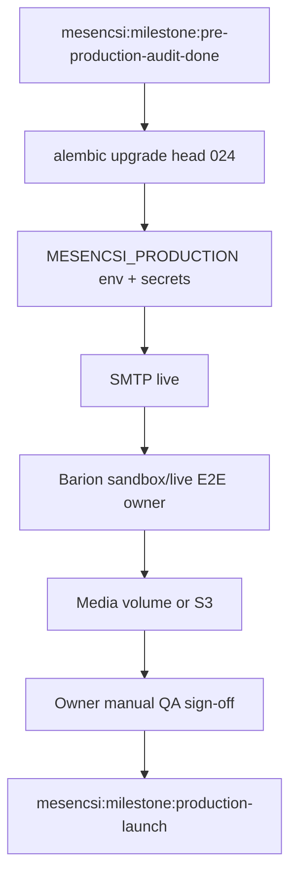

# Mesencsi — Graph-ID status & roadmap

**Purpose:** Single source for *where we are now* and *where we are heading*, structured for later import into **Graph-ID** (nodes, edges, milestones).  
**Last updated:** 2026-05-28  
**Verdict:** **GO WITH CONDITIONS** — production-ready software; external ops/QA still required.

**Related (human docs):** [PROJECT_CONTINUATION.md](PROJECT_CONTINUATION.md) · [HANDOVER.md](HANDOVER.md) · [backend/docs/deploy_readiness.md](backend/docs/deploy_readiness.md) · [backend/docs/pre_production_qa.md](backend/docs/pre_production_qa.md)

---

## Graph-ID metadata (import hints)

```yaml
project:
  graph_id: mesencsi:root
  name: Mesencsi
  type: childrens-book-webshop
  repo_path: project/
  stack: [fastapi, postgresql, static-html-js, barion, playwright-e2e]

current_milestone:
  graph_id: mesencsi:milestone:pre-production-audit-done
  status: complete
  score_readiness: 76
  gate: GO_WITH_CONDITIONS

next_milestone:
  graph_id: mesencsi:milestone:production-launch
  status: blocked_external
  depends_on:
    - mesencsi:blocker:smtp-live
    - mesencsi:blocker:barion-owner-qa
    - mesencsi:blocker:owner-manual-qa
    - mesencsi:blocker:media-persistence-plan

schema_version: 1
alembic_head: "024_password_reset_tokens"
```

---

## 1. Where we are now (snapshot)

### 1.1 Product & architecture

| Node ID | State | Summary |
|---------|-------|---------|
| `mesencsi:domain:commerce` | **ready** | Register → verify → cart → checkout → Barion → paid; server-side pricing; payment attempts (migration 023) |
| `mesencsi:domain:admin` | **ready** | Orders, products, news, gallery, storybooks, coupons; owner vs maintenance roles |
| `mesencsi:domain:shipping` | **ready_manual** | HU structured address + notes on orders; all-in product price; no fee/tracking/carrier API |
| `mesencsi:domain:frontend-shop` | **modular_stable** | 18 modules under `frontend/js/` + `app.js` (~1761 lines) composition root |
| `mesencsi:domain:frontend-admin` | **monolith_ok** | `admin.html` inline script — acceptable for single operator |
| `mesencsi:domain:deploy` | **docs_ready** | `deploy_readiness.md`, `pre_production_qa.md`, `.env.example` updated (024, Redis, proxy, media) |

### 1.2 Recent engineering (completed)

| Node ID | What | Evidence |
|---------|------|----------|
| `mesencsi:fix:csrf-payment-retry` | CSRF before Barion retry | `frontend/js/checkout.js`, `frontend/js/api.js` |
| `mesencsi:fix:preset-avatars` | Preset profile image URLs allowed | `backend/image_upload.py`, `frontend/app.js` |
| `mesencsi:fix:ui-notify` | Shared toasts / busy states (shop + partial admin) | `frontend/js/notify.js` |
| `mesencsi:fix:cart-clear-on-order` | Server cart cleared on `POST /orders` | `backend/routers/cart.py`, `backend/mesencsi.py`, `test_cart_persistence.py` |
| `mesencsi:fix:orders-shipping-ui` | Shipping + notes on “Rendeléseim” | `frontend/js/orders-ui.js` |
| `mesencsi:fix:trusted-proxy` | `TRUSTED_PROXY_HOSTS` (default `127.0.0.1`, not `*`) | `backend/mesencsi.py` |
| `mesencsi:fix:csp-upgrade` | `upgrade-insecure-requests` when production | `backend/security_headers.py` |
| `mesencsi:audit:pre-production` | Gap analysis + doc/ops implementation | Plan todos complete; plan file not edited |

### 1.3 Test & automation posture

| Node ID | State | Notes |
|---------|-------|-------|
| `mesencsi:test:pytest` | **green** | 32 test modules; SQLite in-memory default; optional Postgres smoke |
| `mesencsi:test:e2e` | **exists_not_full** | Playwright: public, auth, shop panel, admin login — **no** real Barion, IPN, SMTP inbox |
| `mesencsi:test:manual-qa` | **pending_owner** | [pre_production_qa.md](backend/docs/pre_production_qa.md), [REVIEW_CHECKLIST.md](REVIEW_CHECKLIST.md) §I |

### 1.4 External blockers (not software bugs)

| Node ID | Owner | Blocks |
|---------|-------|--------|
| `mesencsi:blocker:smtp-live` | ops | Verify + payment confirmation emails |
| `mesencsi:blocker:barion-owner-qa` | owner | Sandbox/live POS end-to-end sign-off |
| `mesencsi:blocker:owner-manual-qa` | owner | Checklist on target environment |
| `mesencsi:blocker:media-persistence-plan` | ops | Volume or S3 if catalog relies on uploads |
| `mesencsi:blocker:shipping-copy` | content | Customer-facing “manual ship, X days” text (checkout/email) |

### 1.5 Known accepted risks (documented, not launch blockers)

| Node ID | Severity | Note |
|---------|----------|------|
| `mesencsi:risk:csp-unsafe-inline` | high | XSS mitigation weakened until inline scripts removed |
| `mesencsi:risk:staging-ipn` | high | Public staging without `BARION_IPN_SECRET` + prod flag |
| `mesencsi:risk:csrf-readable-cookie` | medium | Mitigate via CSP over time |
| `mesencsi:risk:cart-abandon` | low | Mitigated: server cart clear on order create |
| `mesencsi:risk:coupon-reuse` | low | No redemption ledger if single-use needed later |
| `mesencsi:risk:partial-order-delete` | medium | Multi-line checkout group may desync |

---

## 2. Frontend composition (`app.js` audit summary)

**File:** `frontend/app.js` (~1761 lines) — **do not refactor before production.**

| Bucket | ~% | Graph nodes | Direction |
|--------|-----|-------------|-----------|
| **SAFE TO KEEP** | 30% | `mesencsi:frontend:glue`, `mesencsi:frontend:init-mesencsi-shop` | Stay as composition root |
| **SHOULD EXTRACT** (post-launch) | 50% | `mesencsi:frontend:user-dock`, `mesencsi:frontend:profile`, `mesencsi:frontend:checkout-shipping` | Extract in order: checkout shipping → profile → user-dock |
| **OPTIONAL** | 20% | `mesencsi:frontend:address-wrappers`, `mesencsi:frontend:util-delegators` | Cleanup only |

**Modules already extracted:** `api`, `auth-ui`, `boot`, `cart`, `checkout`, `discounts-ui`, `dom-utils`, `gallery`, `nav-overlays`, `news`, `notify`, `orders-ui`, `products`, `router`, `storage`, `storybooks`, `validate-address`.

---

## 3. Where we are heading next

### 3.1 Critical path → production launch



| Step | Graph ID | Type | Owner |
|------|----------|------|-------|
| 1 | `mesencsi:task:migrate-024` | ops | dev/ops |
| 2 | `mesencsi:task:prod-env` | ops | dev/ops |
| 3 | `mesencsi:task:smtp` | external | ops |
| 4 | `mesencsi:task:barion-e2e` | external | owner |
| 5 | `mesencsi:task:media-persist` | ops | ops |
| 6 | `mesencsi:task:manual-qa` | qa | owner |
| 7 | `mesencsi:task:shipping-copy` | content | owner |
| 8 | `mesencsi:milestone:production-launch` | milestone | — |

**Launch checklist:** [backend/docs/deploy_readiness.md](backend/docs/deploy_readiness.md) §1, §9 · [backend/docs/pre_production_qa.md](backend/docs/pre_production_qa.md)

---

### 3.2 Post-launch engineering (priority order)

| Priority | Graph ID | Workstream | Rationale |
|----------|----------|------------|-----------|
| P1 | `mesencsi:future:csp-no-inline` | Security | Remove `unsafe-inline` from CSP after script hygiene |
| P2 | `mesencsi:future:extract-checkout-shipping` | Frontend maintainability | ~190 lines in `app.js`; checkout module already wired |
| P3 | `mesencsi:future:extract-profile` | Frontend maintainability | ~670 lines; highest churn risk |
| P4 | `mesencsi:future:extract-user-dock` | Frontend maintainability | SPA account overlay |
| P5 | `mesencsi:future:coupon-ledger` | Business rules | Only if single-use coupons required |
| P6 | `mesencsi:future:shipping-fee-ui` | Product | Flat fee / threshold — business decision |
| P7 | `mesencsi:future:tracking-shipped-email` | Product | Tracking field + notification |
| P8 | `mesencsi:future:checkout-group-constraints` | Data integrity | DB constraint on `checkout_group_id` payment sync |
| P9 | `mesencsi:future:ci-gates` | DevOps | Wire `gate_pytest.ps1` / `gate_e2e.ps1` in CI |
| P10 | `mesencsi:future:postgres-ci-smoke` | DevOps | Optional `test_postgres_smoke.py` in pipeline |

---

### 3.3 Explicit non-goals (unless product changes)

- Admin panel rewrite (`admin.html` monolith stays).
- Carrier / warehouse integration.
- Automated fulfillment beyond manual `status` dropdown.
- Large `app.js` refactor **before** production sign-off.

---

## 4. Graph edges (relationships for import)

```
mesencsi:milestone:production-launch
  ├─ blocked_by → mesencsi:blocker:smtp-live
  ├─ blocked_by → mesencsi:blocker:barion-owner-qa
  ├─ blocked_by → mesencsi:blocker:owner-manual-qa
  ├─ blocked_by → mesencsi:blocker:media-persistence-plan
  ├─ requires → mesencsi:task:migrate-024
  ├─ requires → mesencsi:task:prod-env
  └─ documented_in → backend/docs/deploy_readiness.md

mesencsi:milestone:pre-production-audit-done
  ├─ supersedes → mesencsi:doc:deploy-readiness-021-drift
  ├─ implemented → mesencsi:fix:cart-clear-on-order
  ├─ implemented → mesencsi:fix:orders-shipping-ui
  └─ child_audit → mesencsi:audit:app-js (classification only, no code change)

mesencsi:future:extract-profile
  ├─ depends_on → mesencsi:milestone:production-launch
  └─ reduces_risk → mesencsi:frontend:app-js-churn

mesencsi:domain:commerce
  ├─ integrates → mesencsi:integration:barion
  ├─ uses → mesencsi:schema:024
  └─ tested_by → mesencsi:test:pytest
```

---

## 5. File → domain map (for Graph-ID anchors)

| Path | Graph ID suffix | Role |
|------|-----------------|------|
| `backend/mesencsi.py` | `backend:shop-api` | Orders, composition |
| `backend/routers/payments_barion.py` | `backend:barion` | Payment start, IPN, return |
| `backend/routers/user_mvp.py` | `backend:auth` | Register, login, reset |
| `backend/routers/cart.py` | `backend:cart` | Persistent cart |
| `backend/admin_routes.py` | `backend:admin-api` | Admin CRUD |
| `backend/startup_config.py` | `backend:prod-guard` | Production env validation |
| `frontend/app.js` | `frontend:composition-root` | Init + profile + dock glue |
| `frontend/js/*.js` | `frontend:module:*` | Feature modules |
| `frontend/admin.html` | `frontend:admin-ui` | Operator panel |
| `e2e/tests/` | `test:e2e` | Playwright |
| `backend/tests/` | `test:pytest` | API/integration |

---

## 6. Session handoff one-liner

> **Now:** Code and pytest are production-capable; pre-production audit items are implemented in tree; docs point to Alembic **024** and owner QA. **Next:** External SMTP + Barion owner test + media plan + manual sign-off, then live deploy. **Later:** CSP hardening, `app.js` extractions (profile → dock), shipping fee/tracking if the business wants them.

---

## 7. Maintenance of this document

When closing a milestone or starting a workstream:

1. Update **Last updated** and `current_milestone` / `next_milestone` in §Graph-ID metadata.
2. Move completed items from §3 to §1.2 with a new `mesencsi:fix:*` or `mesencsi:milestone:*` node.
3. Add Graph edges if a new blocker or dependency appears.
4. Keep [PROJECT_CONTINUATION.md](PROJECT_CONTINUATION.md) in sync for day-to-day dev (short form); this file is the **Graph-ID–oriented** long snapshot.
