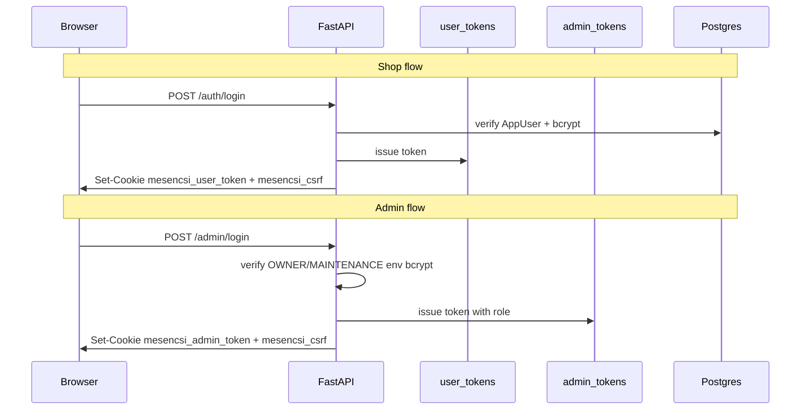

# Mesencsi Backend Core Extraction Audit

**Milestone 0 — Read-only audit**

| Field | Value |
|-------|-------|
| **Audited codebase** | `backend/` in this sandbox copy of Mesencsi |
| **Original Mesencsi project** | Must remain untouched |
| **Target reuse name** | **Grafi Backend Core** |
| **Intended consumers** | KeepMeRollin website, future webshop/client projects |
| **Audit date** | 2026-05-30 |
| **Scope** | Auth, users/roles, JWT/security, SMTP/email, verification, password reset, logging, audit/event logs, health, config, Barion/payments, existing tests |
| **Out of scope** | Frontend, Storybook, gallery, news/content, Mesencsi branding, UI polish |
| **Changes made** | None — no refactor, file moves, deletions, or behavior changes |

---

## Executive Summary

The Mesencsi backend already contains a **solid security and infrastructure foundation** suitable for Grafi Backend Core: JWT issuance, bcrypt password hashing, CSRF double-submit, security headers, rate limiting, SMTP configuration, structured stdout logging, and a well-isolated Barion HTTP client. These modules are largely self-contained and can be copied into a shared package with minimal parameterization (cookie names, env prefixes, exempt paths).

The **HTTP and domain layers are tightly welded to Mesencsi**: monolithic routers (`user_mvp.py`, `admin_routes.py`), a fat `AppUser` model with shipping and profile fields, Hungarian user-facing copy, hardcoded `mesencsi_*` cookie names, and payment sync logic bound to `ShopOrder` / `checkout_group_id`. Extracting reusable auth or payment flows requires splitting routers and introducing repository interfaces before any code move.

**Overall extraction readiness:** ~40% directly portable (GREEN), ~45% portable with interfaces and configuration (YELLOW), ~15% should remain Mesencsi-specific (RED).

**Barion status:** **Implemented / code-tested / pending real sandbox merchant validation.** The payment flow has extensive mocked pytest coverage and production-oriented design (GetPaymentState as single source of truth, idempotent sync, IPN secret enforcement). End-to-end validation against `api.test.barion.com` remains blocked on merchant POSKey, payee email, and a public HTTPS tunnel for IPN — see `BARION_SANDBOX_TESTING.md`.

**Stack:** FastAPI 0.115+, SQLAlchemy 2, Alembic, PyJWT, bcrypt, slowapi, optional Redis, stdlib SMTP. App entry: `backend/mesencsi.py`. Tests: 33 pytest modules in `backend/tests/`.

```mermaid
flowchart TB
  subgraph coreCandidate [Grafi Backend Core candidates]
    JWT[user_tokens + admin_tokens]
    Crypto[password_utils]
    CSRF[csrf + security_headers]
    Limits[auth_limits + login_throttle]
    EmailCore[email_config + email_outbound transport]
    Logging[app_logging + incident_support]
    Config[env_loader + startup_config + runtime_flags]
    BarionClient[barion_api.py]
  end
  subgraph mesencsiBound [Mesencsi-bound today]
    UserRouter[user_mvp.py monolith]
    AdminRouter[admin_routes.py monolith]
    AppUser[AppUser ORM + shipping fields]
    Orders[ShopOrder + checkout_group_id]
    PayRouter[payments_barion sync logic]
    HealthBiz[health_service business checks]
  end
  mesencsi.py --> coreCandidate
  mesencsi.py --> mesencsiBound
  PayRouter --> BarionClient
  PayRouter --> Orders
```

---

## GREEN / YELLOW / RED Summary Table

| Module | Reusability | Extraction Difficulty |
|--------|-------------|----------------------|
| JWT & tokens | GREEN | LOW |
| Password cryptography | GREEN | LOW |
| CSRF & security middleware | GREEN | LOW |
| SMTP & email configuration | GREEN | LOW |
| Application logging | GREEN | LOW |
| Request metrics | GREEN | LOW |
| Barion API client | GREEN | LOW |
| Test infrastructure | GREEN | LOW |
| Shop user authentication | YELLOW | HIGH |
| Admin authentication & RBAC | YELLOW | MEDIUM |
| Email outbound (auth + order mail) | YELLOW | MEDIUM |
| Email verification | YELLOW | MEDIUM |
| Password reset | YELLOW | MEDIUM |
| Failure audit (incidents) | YELLOW | MEDIUM |
| Health endpoints | YELLOW | MEDIUM |
| Environment & startup config | YELLOW | MEDIUM |
| Barion payment flow | YELLOW | HIGH |
| Shop profile / domain user model | RED | HIGH |
| Admin domain CRUD router | RED | HIGH |
| Order / checkout domain | RED | HIGH |
| Gallery / news / storybooks | RED | N/A (out of scope) |

---

## Module Audits

Each section follows the same structure: files, responsibility, reusability rating, coupling, dependencies, tests, gaps, extraction target, what stays, and risks.

---

### Module 1: JWT & Token Management

**Reusability:** GREEN | **Extraction difficulty:** LOW

#### 1. Files involved

- `backend/user_tokens.py` — shop user JWT issue/parse
- `backend/admin_tokens.py` — admin JWT issue/parse
- `backend/dependencies.py` — consumes parsed tokens (partial; see Module 3/4)

#### 2. Current responsibility

Issues and validates JSON Web Tokens for two independent domains:

| Domain | Claims | Secret env var | Cookie (when used) |
|--------|--------|----------------|---------------------|
| Shop | `typ=user`, `sub=user_id` | `USER_JWT_SECRET` | `mesencsi_user_token` |
| Admin | `typ=admin`, `sub=username`, `role=owner\|maintenance` | `ADMIN_JWT_SECRET` | `mesencsi_admin_token` |

Both support Bearer header or HttpOnly cookie. Cross-domain tokens are rejected (shop token cannot access admin routes).

#### 3. Reusability: GREEN

Clean separation of JWT crypto from HTTP routing. Only env var names, logger prefixes, and error message strings are Mesencsi-branded.

#### 4. Mesencsi-specific coupling

- Logger names: `mesencsi.user_jwt`, `mesencsi.admin_jwt`
- Hungarian error strings on parse failure
- Fixed claim schema (`typ`, `sub`, `role`) — reasonable default but not configurable today

#### 5. External dependencies

- PyJWT
- stdlib (`os`, `datetime`, `logging`)

#### 6. Existing tests

- `backend/tests/test_admin_jwt_auth.py` — admin JWT roundtrip, expiry, legacy token rejection, role gate (maintenance cannot create product), shop token rejected on admin routes

#### 7. Missing tests

- Shop token unit tests: expiry, wrong `typ`, malformed `sub`, missing secret
- Shop token rejected on admin routes (only one case covered indirectly)
- Cookie-only token extraction (most tests use Bearer)

#### 8. Extraction difficulty: LOW

#### 9. What should be extracted into Grafi Backend Core

- Generic `JwtSettings` (secret, expiry, algorithm)
- Token issue/parse functions with configurable claim schema and `typ` discriminator
- Startup logging helper for secret presence/length

#### 10. What should stay Mesencsi-specific

- Dual-domain split configuration (which domains exist, default expiry values)
- Mesencsi cookie names (configured at app layer, not in core)

#### 11. Risks / blockers

- Low risk — cleanest extraction candidate in the codebase

---

### Module 2: Password Cryptography

**Reusability:** GREEN | **Extraction difficulty:** LOW

#### 1. Files involved

- `backend/password_utils.py`

#### 2. Current responsibility

bcrypt password hashing and verification used by shop registration/login, password reset, and env-based admin credential verification.

#### 3. Reusability: GREEN

No domain coupling. Pure crypto utility.

#### 4. Mesencsi-specific coupling

None significant.

#### 5. External dependencies

- bcrypt

#### 6. Existing tests

Indirect coverage via `test_password_reset.py`, `test_auth_email_verify_flow.py`, `test_login_throttle_integration.py`, and admin auth tests.

#### 7. Missing tests

- Dedicated unit tests for hash/verify roundtrip, empty password edge cases, invalid hash handling

#### 8. Extraction difficulty: LOW

#### 9. What should be extracted into Grafi Backend Core

- Entire module as-is

#### 10. What should stay Mesencsi-specific

- Nothing

#### 11. Risks / blockers

- None

---

### Module 3: Shop User Authentication

**Reusability:** YELLOW | **Extraction difficulty:** HIGH

#### 1. Files involved

- `backend/routers/user_mvp.py` — auth + profile + avatar + coupons (~750 lines)
- `backend/dependencies.py` — `get_current_app_user`, email-verified guards
- `backend/login_throttle.py` — DB-backed failed-login counter (15-min lock)
- `backend/db_models.py` — `AppUser`, `LoginThrottle`
- `backend/models.py` — auth Pydantic DTOs (`UserCreate`, `UserLogin`, etc.)
- `backend/shipping_address.py` — Hungarian phone validation (used in profile)
- Alembic: `006_users_table.py`, `014_email_verify_login_throttle.py`, `017_users_admin_soft_delete_ban_login.py`, `024_password_reset_tokens.py`

#### 2. Current responsibility

- Register → bcrypt hash → optional verification email → JWT + cookies on login
- Login checks: throttle, deleted/banned/inactive, password verify, clears throttle on success
- Logout, `/auth/me`, `/auth/csrf`
- Cookie + Bearer dual auth model
- Guards: `require_email_verified_shop_user`, `require_email_verified_to_place_order`
- **Also in same router:** profile PATCH, avatar upload, soft-delete, coupon listing

#### 3. Reusability: YELLOW

Auth patterns are sound but embedded in a monolithic router tied to a fat user model.

#### 4. Mesencsi-specific coupling

- Cookie names: `mesencsi_user_token`, `mesencsi_csrf`
- Fat `AppUser`: shipping/billing addresses, `family_note`, `profile_image_url`
- Hungarian validation messages throughout
- Register honeypot field `company_website`
- Dev schema self-heal in `login_user` (`ProgrammingError` fallback for missing columns)
- `shipping_address.py` Hungarian phone rules
- Rate limits and CSRF exemptions wired to Mesencsi route paths

#### 5. External dependencies

- FastAPI, Starlette (cookies)
- SQLAlchemy
- slowapi (rate limits via `auth_limits.py`)
- bcrypt, email modules (verification on register)
- PyJWT (via `user_tokens.py`)

#### 6. Existing tests

- `backend/tests/test_csrf_cookie_flow.py` — cookie login → CSRF required on `POST /orders`
- `backend/tests/test_auth_email_verify_flow.py` — register, verify, resend, login after verify
- `backend/tests/test_login_throttle_integration.py` — 5 failures → 429; success clears throttle
- `backend/tests/test_order_email_verification_guard.py` — unverified user blocked from placing orders
- `backend/tests/test_profile_image_url_validation.py` — profile field validation (domain-adjacent)

#### 7. Missing tests

- Banned/deleted/inactive user login rejection
- Cookie-only auth on protected routes (most tests use Bearer, bypassing CSRF)
- Logout cookie-clearing assertions
- Register honeypot (`company_website`) rejection
- Shop JWT unit tests (see Module 1)
- Profile email-change → re-verify flow

#### 8. Extraction difficulty: HIGH

Router must be split before auth endpoints can move.

#### 9. What should be extracted into Grafi Backend Core

- `login_throttle.py` — generic IP/email throttle store
- Auth dependency pattern (`get_current_user` with injectable repository)
- Thin `UserAuthRouter` factory accepting: user model protocol, cookie names, email sender callback

#### 10. What should stay Mesencsi-specific

- Profile, avatar, coupon routes in `user_mvp.py`
- Hungarian phone/shipping fields on `AppUser`
- `MESENCSI_PROTECTED_SHOP_EMAILS` (admin moderation)
- Dev schema self-heal in login

#### 11. Risks / blockers

- `user_mvp.py` monolith blocks extraction without prior router split
- Fat user model forces either migration of extra columns or a separate auth identity table in core

---

### Module 4: Admin Authentication & RBAC

**Reusability:** YELLOW | **Extraction difficulty:** MEDIUM

#### 1. Files involved

- `backend/auth.py` — env-based admin credential loading, `authenticate_admin()`
- `backend/admin_routes.py` — admin login/logout/me **plus** entire admin panel (~650 lines)
- `backend/dependencies.py` — `get_current_admin`, `require_role([...])`
- `backend/admin_tokens.py` — admin JWT (see Module 1)
- `backend/scripts/setup_admin_credentials.py` — generate/update admin `.env` credentials

#### 2. Current responsibility

- **No admin DB table** — two fixed env accounts: `OWNER_*` and `MAINTENANCE_*` (bcrypt password hashes)
- Roles: `owner` (full write) vs `maintenance` (read-mostly; logs, system info)
- Admin login sets `mesencsi_admin_token` + CSRF cookie; also returns token in JSON (legacy/API clients)
- Authorization is endpoint-level via `require_role([...])` scattered across admin routers
- **Not a general RBAC system** — two hardcoded roles only

#### 3. Reusability: YELLOW

The env-admin + JWT + role-gate pattern is reusable for small projects; the router is not.

#### 4. Mesencsi-specific coupling

- Admin login mixed with orders, products, gallery, stories, logs CRUD in `admin_routes.py`
- `MESENCSI_PROTECTED_SHOP_EMAILS` for shop user moderation
- Hungarian 503 when admin credentials unconfigured
- Env var names: `OWNER_USERNAME`, `MAINTENANCE_PASSWORD`, etc.

#### 5. External dependencies

- bcrypt (`password_utils.py`)
- PyJWT (`admin_tokens.py`)
- FastAPI

#### 6. Existing tests

- `backend/tests/test_admin_jwt_auth.py` — JWT roundtrip, role gate, cross-domain rejection
- `backend/tests/test_admin_csrf_delete_user.py` — admin cookie auth + CSRF on `DELETE /admin/users/{id}`

#### 7. Missing tests

- HTTP test for `POST /admin/login` with real env credentials or 503 when unconfigured
- Comprehensive owner vs maintenance permission matrix
- Admin login rate limit (`12/minute` declared, not tested)

#### 8. Extraction difficulty: MEDIUM

Auth logic is small; router separation is the main work.

#### 9. What should be extracted into Grafi Backend Core

- Env-based admin credential loader (configurable env prefix and role names)
- `require_role` dependency factory
- Thin admin auth router (login/logout/me only)

#### 10. What should stay Mesencsi-specific

- All domain admin CRUD in `admin_routes.py`
- Mesencsi protected shop emails
- Admin routes for gallery, stories, news, products, orders

#### 11. Risks / blockers

- Future projects (e.g. KeepMeRollin) may need DB-backed admin users — env-only model is intentionally simple but not universal
- Splitting `admin_routes.py` is prerequisite for clean extraction

---

### Module 5: CSRF & Security Middleware

**Reusability:** GREEN | **Extraction difficulty:** LOW

#### 1. Files involved

- `backend/csrf.py` — `CsrfMiddleware`, double-submit CSRF
- `backend/security_headers.py` — CSP, X-Frame-Options, HSTS (production), etc.
- `backend/auth_limits.py` — slowapi `Limiter` (IP-based; Redis if `REDIS_URL`, else in-memory)
- `backend/cors_config.py` — CORS origin resolution; strict production rules
- `backend/openapi_docs.py` — disables `/docs` in production

#### 2. Current responsibility

- **CSRF:** double-submit pattern (`mesencsi_csrf` cookie + `X-CSRF-Token` header); Bearer auth bypasses CSRF; exempt paths for auth login/register, verify-email, forgot/reset password, Barion IPN
- **Security headers:** applied to all responses
- **Rate limiting:** slowapi limiter attached to auth and sensitive endpoints
- **CORS:** dev localhost defaults; production requires explicit origins; wildcard/localhost blocked in production
- **OpenAPI:** hidden when `MESENCSI_PRODUCTION=true`

#### 3. Reusability: GREEN

Well-tested, standard patterns. Parameterization needed for cookie names and exempt paths.

#### 4. Mesencsi-specific coupling

- Cookie name `mesencsi_csrf`
- CSRF exempt path list includes Mesencsi-specific routes
- `MESENCSI_PRODUCTION` flag used by CORS and OpenAPI modules

#### 5. External dependencies

- Starlette middleware
- slowapi
- redis (optional, for distributed rate limits)

#### 6. Existing tests

- `backend/tests/test_csrf_cookie_flow.py`
- `backend/tests/test_security_headers.py` — headers on `/health`, HTML, 404, redirects
- `backend/tests/test_cors_config.py` — dev defaults, production rules, wildcard blocking
- `backend/tests/test_cors_http_integration.py` — HTTP CORS behavior
- `backend/tests/test_openapi_docs.py` — production hides docs

#### 7. Missing tests

- Bearer bypass of CSRF (explicit test)
- Exempt path matrix (register, IPN, verify-email, etc.)
- Production HSTS and `upgrade-insecure-requests` assertion
- Redis-backed rate limit integration test

#### 8. Extraction difficulty: LOW

#### 9. What should be extracted into Grafi Backend Core

- All five modules with configurable: cookie names, exempt paths, production flag name, CORS defaults

#### 10. What should stay Mesencsi-specific

- Mesencsi exempt route list until apps register their own at startup

#### 11. Risks / blockers

- Low — well-tested, proven patterns

---

### Module 6: SMTP & Email Configuration

**Reusability:** GREEN | **Extraction difficulty:** LOW

#### 1. Files involved

- `backend/email_config.py` — SMTP env contract, mode detection, hosted rules, provider heuristics
- `backend/email_errors.py` — `EmailNotConfiguredError`, `EmailSendError`
- `backend/smtp_credential_proof.py` — dev-only `.env` vs runtime env comparison
- `backend/routers/dev_diagnostics.py` — `GET /dev/smtp-config`, `GET /dev/smtp-credential-proof`
- `backend/docs/render_smtp.md`, `backend/docs/resend_smtp.md`, `backend/docs/local_auth_email_qa.md`
- `backend/docker-compose.yml` — optional Mailpit service

#### 2. Current responsibility

- SMTP mode detection: `none` / `relay` / `mailpit` / `partial`
- Hosted deployment detection (`RENDER`, `ENVIRONMENT`, `MESENCSI_PRODUCTION`)
- Provider heuristics: Gmail, Resend, Brevo, MailerSend, Mailpit
- Transport mode: SSL / STARTTLS / plain
- Startup diagnostic logging via `log_smtp_config_at_startup()`
- Dev credential proof endpoint (hidden on hosted)

#### 3. Reusability: GREEN

Self-contained configuration layer with no Mesencsi business logic.

#### 4. Mesencsi-specific coupling

- `RENDER` and `MESENCSI_PRODUCTION` in hosted detection logic
- Backend dir layout assumption in credential proof
- Logger name `mesencsi.email_config`

#### 5. External dependencies

- stdlib (`os`, `logging`)
- python-dotenv (credential proof reads `.env` file)

#### 6. Existing tests

- `backend/tests/test_email_config_modes.py` — Gmail relay, Mailpit, Brevo From misconfig, Resend/MailerSend flags
- `backend/tests/test_dev_smtp_diagnostics.py` — `/dev/smtp-config` local vs hidden on `RENDER=true`
- `backend/tests/test_startup_config.py` — hosted missing SMTP fatal when `RENDER=true`

#### 7. Missing tests

- `GET /dev/smtp-credential-proof` endpoint
- Brevo "accepted but not delivered" warning when From is `@smtp-brevo.com`

#### 8. Extraction difficulty: LOW

#### 9. What should be extracted into Grafi Backend Core

- Full SMTP config module and error types
- Generic hosted-deployment hook (pluggable detectors instead of hardcoded `RENDER`)

#### 10. What should stay Mesencsi-specific

- Render-specific assumptions (can become one deploy adapter)

#### 11. Risks / blockers

- Low

---

### Module 7: Email Outbound (Auth + Order Mail)

**Reusability:** YELLOW | **Extraction difficulty:** MEDIUM

#### 1. Files involved

- `backend/email_outbound.py` — single send path via `smtplib`
- `backend/payment_confirmation_email.py` — post-Barion-paid confirmation (uses email_outbound)
- `backend/runtime_flags.py` — dev log fallback flags

#### 2. Current responsibility

- All outbound mail through one `smtplib` implementation
- Auth emails: verification (`{FRONTEND_BASE_URL}/?email_verify_token=…`), password reset (`/reset-password.html?token=…`)
- Order confirmation after verified `paid` status
- Dev fallback: log links to terminal when SMTP absent (non-production)
- Defines `RESEND_COOLDOWN_SEC` (120) imported by `user_email_verify.py`

#### 3. Reusability: YELLOW

Transport layer is generic; templates and URLs are Mesencsi-specific.

#### 4. Mesencsi-specific coupling

- **High:** Hungarian copy, "Mesencsi" branding in subjects and footers
- URL shapes tied to Mesencsi frontend layout
- Debug log artifact path (`debug-624d64.log` at repo parent — session artifact)
- Cross-module constant export (`RESEND_COOLDOWN_SEC`) creates awkward dependency direction

#### 5. External dependencies

- stdlib `smtplib`, `email.message.EmailMessage`
- `email_config.py`, `runtime_flags.py`

#### 6. Existing tests

- `backend/tests/test_email_outbound.py` — transport modes, dev missing SMTP logs, production raises, mocked `_smtp_session`
- `backend/tests/test_payment_confirmation_email.py` — confirmation scheduled once on duplicate IPN; body building (mocked send)

#### 7. Missing tests

- Real SMTP / Mailpit integration test
- Template / i18n abstraction tests
- Async/background send pattern (currently synchronous in request path)

#### 8. Extraction difficulty: MEDIUM

#### 9. What should be extracted into Grafi Backend Core

- Transport layer: `_smtp_session`, mode checks, `EmailNotConfiguredError` / `EmailSendError` handling
- Template interface: `EmailTemplate` protocol (subject, plain body, optional HTML)
- Configurable base URL builder

#### 10. What should stay Mesencsi-specific

- Hungarian email templates and Mesencsi URL paths
- Order confirmation copy referencing Mesencsi branding

#### 11. Risks / blockers

- Synchronous SMTP in request handlers can stall under slow providers — architectural concern for all Grafi projects
- Template extraction requires i18n strategy decision in Milestone 2

---

### Module 8: Email Verification

**Reusability:** YELLOW | **Extraction difficulty:** MEDIUM

#### 1. Files involved

- `backend/user_email_verify.py` — token issue/assign/verify
- `backend/routers/user_mvp.py` — `POST /auth/register`, `GET /auth/verify-email`, `POST /auth/resend-verification`; email change re-verify on profile PATCH
- `backend/admin_routes.py` — `POST /admin/users/{user_id}/resend-verification`
- `backend/db_models.py` — `email_verified_at`, `email_verification_token`, `email_verification_sent_at` on `AppUser`
- Alembic: `014_email_verify_login_throttle.py`

#### 2. Current responsibility

- Token issue on register and email change
- Verify via `GET /auth/verify-email?token=…` (48h TTL)
- Resend with 120s cooldown (`can_resend_verification`)
- Admin resend for support workflows

#### 3. Reusability: YELLOW

Token lifecycle logic is separable; storage is on fat `AppUser` ORM.

#### 4. Mesencsi-specific coupling

- Token columns on Mesencsi `AppUser` model
- Cooldown constant lives in `email_outbound.py` (inverted dependency)
- Verification link URL shape tied to Mesencsi frontend

#### 5. External dependencies

- SQLAlchemy
- stdlib `secrets` / token generation
- `email_outbound.py` for send

#### 6. Existing tests

- `backend/tests/test_auth_email_verify_flow.py` — register, token saved, verify, resend with CSRF, production SMTP strictness, login after verify

#### 7. Missing tests

- Verification token 48h expiry at HTTP layer
- Resend cooldown → 429 within 120s window
- Admin resend verification (503 on SMTP fail, maintenance role)
- Direct unit tests on `user_email_verify.py` (deleted user, short token)
- Profile email change → re-verify

#### 8. Extraction difficulty: MEDIUM

#### 9. What should be extracted into Grafi Backend Core

- Token lifecycle service: `issue_token`, `verify_token`, `can_resend` — decoupled from ORM via repository protocol

#### 10. What should stay Mesencsi-specific

- Column placement on Mesencsi user model
- Admin resend route wiring in Mesencsi admin panel

#### 11. Risks / blockers

- Requires `UserAuthRepository` interface (see Milestone 1)
- Cooldown constant should move to core config, not email templates module

---

### Module 9: Password Reset

**Reusability:** YELLOW | **Extraction difficulty:** MEDIUM

#### 1. Files involved

- `backend/user_password_reset.py` — token issue, hash storage, validation
- `backend/routers/user_mvp.py` — `POST /auth/forgot-password`, `POST /auth/reset-password`
- `backend/password_utils.py` — bcrypt for new password
- `backend/login_throttle.py` — cleared on successful reset
- Alembic: `024_password_reset_tokens.py`

#### 2. Current responsibility

- Forgot: anti-enumeration (always generic response)
- Plain token issued to user; SHA-256 hash stored in DB
- 60-minute TTL, single-use
- Reset updates password, clears reset token, clears login throttle
- Shop users only (`find_active_shop_user_by_email`); admin accounts are env JWT, not in `users` table

#### 3. Reusability: YELLOW

Pattern is standard and well-tested; tied to shop user lookup.

#### 4. Mesencsi-specific coupling

- Reset link URL: `/reset-password.html?token=…` (Mesencsi frontend)
- Shop-only user lookup
- Token columns on `AppUser`

#### 5. External dependencies

- SQLAlchemy
- stdlib `hashlib` (SHA-256)
- bcrypt via `password_utils.py`

#### 6. Existing tests

- `backend/tests/test_password_reset.py` — unknown email generic response; valid/expired/used/invalid tokens; login with new password
- `backend/tests/test_auth_email_verify_flow.py` — full reset-after-forgot integration

#### 7. Missing tests

- Concurrent forgot: second request overwrites first token (behavior exists, undocumented in tests)
- Rate limit enforcement on forgot endpoint (5/min declared)
- Production SMTP failure behavior on forgot (currently returns generic 200 by design)

#### 8. Extraction difficulty: MEDIUM

#### 9. What should be extracted into Grafi Backend Core

- Reset token service (issue, validate, consume)
- Generic forgot/reset route handlers with injectable user repository and email sender

#### 10. What should stay Mesencsi-specific

- Frontend URL path `/reset-password.html`
- Hungarian email body (Module 7)

#### 11. Risks / blockers

- Low–medium; depends on user repository abstraction from Milestone 1

---

### Module 10: Application Logging

**Reusability:** GREEN | **Extraction difficulty:** LOW

#### 1. Files involved

- `backend/app_logging.py` — `log_event()`, `safe_log_extra()`, `request_id_cv`
- `backend/mesencsi.py` — `_configure_logging()` on lifespan (`LOG_LEVEL`, `MESENCSI_LOG_LEVEL`)

#### 2. Current responsibility

- Structured stdout logging: `event=… | request_id=… | key=value` single-line format
- `safe_log_extra()` redacts passwords, tokens, secrets; truncates long strings
- `request_id_cv` context variable populated by `RequestIdMiddleware` (Module 11)
- Explicitly **not enterprise** — no structlog, JSON sink, or log shipping

Primary consumers: `payments_barion.py`, `user_mvp.py`, `payment_confirmation_email.py`, `admin_routes.py`

#### 3. Reusability: GREEN

Generic logging helpers with no business logic.

#### 4. Mesencsi-specific coupling

- Logger naming convention (`mesencsi.*` prefix on module loggers)
- Event name catalog is Mesencsi-defined (`barion_ipn_*`, `shop_login_failed`, etc.)

#### 5. External dependencies

- stdlib `logging`, `contextvars`

#### 6. Existing tests

None dedicated.

#### 7. Missing tests

- `safe_log_extra` redaction (password, token keys)
- Long-string truncation
- `log_event` output format
- caplog integration asserting event names from payment/auth flows

#### 8. Extraction difficulty: LOW

#### 9. What should be extracted into Grafi Backend Core

- `app_logging.py` as-is with configurable logger prefix
- `_configure_logging()` helper accepting log level env var names

#### 10. What should stay Mesencsi-specific

- Event name catalogs per application

#### 11. Risks / blockers

- Low — useful foundation for all Grafi projects
- No log shipping — ops must aggregate stdout externally

---

### Module 11: Failure Audit (Incidents)

**Reusability:** YELLOW | **Extraction difficulty:** MEDIUM

#### 1. Files involved

- `backend/incident_support.py` — `RequestIdMiddleware`, unhandled exception handler, DB persist
- `backend/routers/incidents.py` — `GET /internal/incidents?limit=50`
- `backend/db_models.py` — `Incident` ORM model
- `backend/models.py` — `IncidentRead` Pydantic schema
- `backend/admin_routes.py` — `GET /admin/logs` (maintenance role)
- Alembic: `002_add_incidents_table.py`

#### 2. Current responsibility

- **Failure audit only** — persists unhandled exceptions to Postgres (`request_id`, method, path, error_type, message, traceback)
- `HTTPException` and validation errors are **not** logged as incidents
- `RequestIdMiddleware`: sets `request.state.request_id`, populates `request_id_cv`, echoes `X-Request-ID`
- Read APIs: token-protected `/internal/incidents` and admin maintenance `/admin/logs`
- **Not a general audit log** — no admin action trail, no user activity log

#### 3. Reusability: YELLOW

Pattern is reusable; scope is intentionally narrow (failures only).

#### 4. Mesencsi-specific coupling

- Mesencsi DB session (`SessionLocal`)
- Hungarian error responses in related modules
- Admin UI integration for `/admin/logs`

#### 5. External dependencies

- SQLAlchemy
- anyio (`to_thread` for DB write from exception handler)
- uuid

#### 6. Existing tests

None.

#### 7. Missing tests

- `RequestIdMiddleware` — `X-Request-ID` echo
- Unhandled handler → DB row persisted
- Persist failure fallback when `incidents` table missing
- Token auth on `/internal/incidents` (403 disabled, 401 bad token, 200 valid)
- `/admin/logs` maintenance-role access and limit bounds
- Consistency between `/internal/incidents` and `/admin/logs`

#### 8. Extraction difficulty: MEDIUM

#### 9. What should be extracted into Grafi Backend Core

- `RequestIdMiddleware`
- `Incident` model + migration template
- Unhandled exception handler + token-protected read endpoint pattern

#### 10. What should stay Mesencsi-specific

- Admin dashboard integration for log viewing

#### 11. Risks / blockers

- Missing `incidents` table causes silent audit write failure (known ops issue — errors still return 500 but audit row is lost)
- Not a substitute for proper admin action audit — do not market as full audit trail

---

### Module 12: Request Metrics

**Reusability:** GREEN | **Extraction difficulty:** LOW

#### 1. Files involved

- `backend/metrics_support.py` — `MetricsMiddleware`, `metrics_endpoint`
- `backend/mesencsi.py` — registers middleware and `GET /internal/metrics`

#### 2. Current responsibility

- In-memory counters per `{method, bucketed_path, status}` plus total milliseconds
- Path bucketing replaces numeric IDs with `{id}`
- `GET /internal/metrics` protected by `X-Metrics-Token` / `METRICS_READ_TOKEN`

#### 3. Reusability: GREEN

Self-contained operational middleware.

#### 4. Mesencsi-specific coupling

- `METRICS_READ_TOKEN` documented in `backend/docs/ops_runbook.md` but **missing from `.env.example`**

#### 5. External dependencies

- Starlette middleware only (no external packages)

#### 6. Existing tests

None.

#### 7. Missing tests

- Path bucketing logic
- Counter accumulation across requests
- `/internal/metrics` token auth (403/200)

#### 8. Extraction difficulty: LOW

#### 9. What should be extracted into Grafi Backend Core

- Entire module as-is

#### 10. What should stay Mesencsi-specific

- Nothing significant

#### 11. Risks / blockers

- In-memory only — not suitable for multi-worker deployments without extension or external aggregation

---

### Module 13: Health Endpoints

**Reusability:** YELLOW | **Extraction difficulty:** MEDIUM

#### 1. Files involved

- `backend/routers/health.py` — route definitions
- `backend/health_service.py` — liveness and business health logic
- `backend/routers/payments_barion.py` — `GET /payments/barion/status` (related Barion config probe)

#### 2. Current responsibility

| Endpoint | Auth | Purpose |
|----------|------|---------|
| `GET /health` | None | Lightweight liveness: `{status, app: "mesencsi", timestamp, environment}` |
| `GET /health/business` | Admin JWT (maintenance or owner) | Deep check: DB ping, core table presence, frontend static files, media uploads writable, admin JWT roundtrip, Barion summary, SMTP summary |
| `GET /payments/barion/status` | None | Barion config snapshot (no secrets) |

Business health returns `ok` or `degraded`.

#### 3. Reusability: YELLOW

Liveness pattern is generic; business health is heavily Mesencsi-opinionated.

#### 4. Mesencsi-specific coupling

- **High in business health:** hard-coded `app: "mesencsi"`, table names (`users`, `orders`, `products`, `login_throttle`), `../frontend/mesencsi.html`, Barion component
- Hungarian docstrings

#### 5. External dependencies

- SQLAlchemy
- `barion_api.py`, `auth.py`, `frontend_assets.py`, `image_upload.py`

#### 6. Existing tests

- `backend/tests/test_health_media.py` — dir writable, frontend static, `run_business_health` degraded paths
- `backend/tests/test_route_registration.py` — `/health` registered before static mounts; live 200 smoke
- `backend/tests/test_postgres_smoke.py` — optional Postgres `/health` 200 (marked `postgres`, skipped by default)
- `backend/tests/test_security_headers.py` — headers on `/health`

#### 7. Missing tests

- HTTP `GET /health/business` with admin JWT
- Barion `sandbox_mode` flag in health JSON
- `GET /payments/barion/status` response shape

#### 8. Extraction difficulty: MEDIUM

#### 9. What should be extracted into Grafi Backend Core

- Lightweight liveness endpoint pattern
- Pluggable `HealthCheck` registry (apps register their own checks)
- Generic DB ping check

#### 10. What should stay Mesencsi-specific

- Mesencsi table list, frontend asset probe, Barion summary component
- Business health composition for Mesencsi deploy checklist

#### 11. Risks / blockers

- Business health must **not** be copied verbatim to KeepMeRollin — different tables, assets, and dependencies

---

### Module 14: Environment & Startup Config

**Reusability:** YELLOW | **Extraction difficulty:** MEDIUM

#### 1. Files involved

- `backend/env_loader.py` — `.env` + optional `.env.py` loader; pytest-safe skip
- `backend/startup_config.py` — production fatal validation vs dev warnings
- `backend/runtime_flags.py` — `MESENCSI_PRODUCTION`, dev auth-email logging, internal debug secret
- `backend/database.py` — DSN from `POSTGRES_*` or `MESENCSI_TEST_DATABASE_URL`
- `backend/.env.example` — canonical env template
- `backend/docs/deploy_readiness.md`, `backend/docs/ops_runbook.md`

#### 2. Current responsibility

- Load env files from backend directory (skipped under pytest via `PYTEST_CURRENT_TEST`)
- Production fatal validation: JWT secrets, CORS, Postgres, Barion HTTPS URLs, SMTP on hosted deploy
- Behavioral flags: stub payment gate, auth email SMTP strictness, dev link logging, internal Barion debug
- Raises `StartupConfigError` when `MESENCSI_PRODUCTION=true` or `hosted_deployment()`

#### 3. Reusability: YELLOW

Pattern is excellent; checklist and env namespace are Mesencsi-specific.

#### 4. Mesencsi-specific coupling

- Entire `MESENCSI_*` env namespace
- Default DB name `mesencsi`
- Validation checklist includes Barion, gallery paths, Mesencsi frontend assumptions
- `METRICS_READ_TOKEN` missing from `.env.example` (doc drift)

#### 5. External dependencies

- python-dotenv
- `cors_config.py`, `email_config.py`, `runtime_flags.py`

#### 6. Existing tests

- `backend/tests/test_startup_config.py` — production fatal vs dev warn; Render SMTP requirement; app lifespan with bad prod config

#### 7. Missing tests

- `env_loader` pytest-skip behavior, `.env.py` override, missing-file warning
- `runtime_flags` unit tests (`mesencsi_production()`, debug secret timing-safe check)
- `TRUSTED_PROXY_HOSTS`, `REDIS_URL`, `MEDIA_STORAGE_MODE` in startup validator

#### 8. Extraction difficulty: MEDIUM

#### 9. What should be extracted into Grafi Backend Core

- Generic `CoreSettings` with configurable env prefix (e.g. `GRAFI_PRODUCTION`)
- Composable startup validators (apps register required checks)
- `env_loader` with pytest-safe skip

#### 10. What should stay Mesencsi-specific

- Mesencsi production checklist items (Barion, frontend paths, gallery)
- `MESENCSI_*` env var names in Mesencsi deploy configs

#### 11. Risks / blockers

- Renaming env vars is a breaking change across Render/staging/production configs
- Must maintain backward compatibility during Mesencsi migration to core

---

### Module 15: Barion API Client

**Reusability:** GREEN | **Extraction difficulty:** LOW

**Barion overall status:** Implemented / code-tested / pending real sandbox merchant validation

#### 1. Files involved

- `backend/barion_api.py`

#### 2. Current responsibility

- Barion REST API v2 client: `POST /v2/Payment/Start`, `GET /v2/Payment/GetPaymentState`
- Sandbox vs production URL selection (`BARION_ENV`, legacy `BARION_SANDBOX` alias)
- Status mapping: Barion `Status` → shop payment status
- Gateway URL builder for browser redirect
- No official Barion SDK — uses stdlib `urllib`

#### 3. Reusability: GREEN

Already isolated. Strongest payment primitive for Hungarian webshop projects.

#### 4. Mesencsi-specific coupling

- Logger name `mesencsi.barion_api`
- Default locale `hu-HU`, currency HUF (reasonable for HU market, configurable)

#### 5. External dependencies

- stdlib `urllib`, `json`, `logging`
- No third-party HTTP library

#### 6. Existing tests

Indirect coverage via payment router tests (mocked HTTP). No dedicated unit tests on this module alone.

#### 7. Missing tests

- Direct unit tests on status mapping (`Succeeded`, `Failed`, `Canceled`, `PartiallySucceeded`)
- Real API contract tests against Barion sandbox (blocked on merchant access)

#### 8. Extraction difficulty: LOW

#### 9. What should be extracted into Grafi Backend Core

- Nearly as-is — configurable defaults for locale, currency, env var prefix

#### 10. What should stay Mesencsi-specific

- Default HUF / hu-HU if other Grafi projects use different markets

#### 11. Risks / blockers

- Low — already the best-isolated payment code
- Barion API shape changes would affect all consumers — monitor Barion changelog

---

### Module 16: Barion Payment Flow

**Reusability:** YELLOW | **Extraction difficulty:** HIGH

**Barion overall status:** Implemented / code-tested / pending real sandbox merchant validation

#### 1. Files involved

- `backend/routers/payments_barion.py` — main payment router
- `backend/payment_confirmation_email.py` — post-`paid` email (daemon thread)
- `backend/db_models.py` — `ShopOrder` (`payment_status`, `barion_payment_id`, `checkout_group_id`); `PaymentAttempt`
- `backend/admin_routes.py` — admin guards (no manual `paid`, delete blocked for pending orders)
- `backend/mesencsi.py` — order create sets `payment_status=pending`
- Alembic: `015_order_payment_barion.py`, `023_payment_attempts.py`
- `BARION_SANDBOX_TESTING.md` — manual sandbox checklist
- `backend/docs/ops_runbook.md`, `backend/docs/pre_production_qa.md`

#### 2. Current responsibility

| Endpoint | Purpose |
|----------|---------|
| `GET /payments/barion/status` | Public config probe |
| `POST /payments/barion/start` | Validate orders → create/resume `PaymentAttempt` → Payment/Start (or stub) |
| `GET /payments/barion/return` | Browser redirect → GetPaymentState sync → frontend redirect |
| `GET /payments/barion/cancel` | Same sync as return |
| `POST /payments/barion/ipn` | Barion CallbackUrl webhook → auth → GetPaymentState sync in worker thread |
| `GET /payments/barion/payment/{id}/state` | Logged-in user poll + sync |
| `POST /payments/barion/callback` | Dev/manual stub callback |
| `POST /payments/barion/webhook` | Deprecated alias of `/callback` |

**Sync engine:** `sync_orders_payment_status_from_barion()` — single authoritative path via GetPaymentState. Handles retry, orphan PaymentId, idempotent paid transition, confirmation email on first `paid`.

**Payment events:** No DB event table. Structured stdout events via `log_event()` (`barion_payment_started`, `barion_orders_synced`, `barion_ipn_rejected_unauthorized`, etc.).

**Stub mode:** When `BARION_POS_KEY` empty — generates `preview-{uuid}` IDs; blocked when `MESENCSI_PRODUCTION=true`.

#### 3. Reusability: YELLOW

Design is production-quality and well-tested, but sync logic is bound to Mesencsi order schema.

#### 4. Mesencsi-specific coupling

- **High:** `ShopOrder.checkout_group_id` multi-line checkout model
- Admin rule: `completed` status only when `paid`
- Hungarian HTTP error messages
- Barion item name `"Webshop rendelés"`
- `MESENCSI_PRODUCTION` stub gate
- Confirmation email uses Mesencsi branding (Module 7)
- `BARION_CANCEL_URL` in `.env.example` is **not referenced in code**

#### 5. External dependencies

- `barion_api.py`
- SQLAlchemy
- anyio (`to_thread` for IPN)
- `email_outbound.py`, `app_logging.py`

#### 6. Existing tests

- `backend/tests/test_barion_payment_hardening.py` — IPN 503, orphan PaymentId, concurrent start, commit recovery
- `backend/tests/test_barion_payment_verify.py` — GetPaymentState sync, idempotent IPN, return redirect, admin paid block
- `backend/tests/test_barion_ipn_auth.py` — IPN secret auth (query/header/bearer), production without secret
- `backend/tests/test_barion_start_duplicate_guard.py` — stub + REST duplicate start, paid block, failed retry
- `backend/tests/test_barion_client_error_messages.py` — no exception leakage to clients
- `backend/tests/test_payment_confirmation_email.py` — email once on duplicate IPN; SMTP failure doesn't break IPN
- `backend/tests/test_checkout_bundle_integration.py` — order totals → Barion start; production stub guards
- `backend/tests/test_admin_order_status.py` — `completed` only when `paid`
- `backend/tests/test_route_registration.py` — Barion routes not swallowed by static mount
- `backend/tests/test_startup_config.py` — production Barion config validation
- `backend/tests/test_security_headers.py` — headers on `/payments/barion/return`

#### 7. Missing tests

- **Real Barion sandbox E2E** — blocked on merchant POSKey + public HTTPS tunnel
- Dedicated test for `GET /payments/barion/cancel`
- `PartiallySucceeded` → `paid` mapping
- Postgres partial unique index on `payment_attempts` (tests use SQLite)
- Admin delete + active `PaymentAttempt` guard
- Deprecated `/webhook` alias
- Health endpoint Barion JSON shape

#### 8. Extraction difficulty: HIGH

#### 9. What should be extracted into Grafi Backend Core

- Payment sync engine as optional plugin with `PaymentRepository` / `OrderPaymentState` protocol
- `PaymentAttempt` pattern (idempotency, retry, orphan handling)
- IPN shared-secret auth pattern
- Stub mode for local dev

#### 10. What should stay Mesencsi-specific

- Order resolution via `ShopOrder` / `checkout_group_id`
- Confirmation email content
- Checkout bundle integration (`bundle_discount_service.py`)
- Admin order lifecycle rules

#### 11. Risks / blockers

- SQLite tests may not catch Postgres-specific partial unique index behavior
- Real sandbox validation requires owner/business Barion merchant access — **pending**
- Unused `BARION_CANCEL_URL` env var suggests incomplete cancel URL wiring

---

### Module 17: Test Infrastructure

**Reusability:** GREEN | **Extraction difficulty:** LOW

#### 1. Files involved

- `backend/tests/conftest.py` — pytest fixtures, test env setup
- `backend/tests/helpers.py` — `auth_headers()`, `admin_headers()`, seed helpers
- `backend/pytest.ini` — pytest configuration

#### 2. Current responsibility

- SQLite in-memory DB for all tests
- Forces test JWT secrets, strips Barion keys for stub mode
- Seed helpers: verified/unverified users, admin tokens
- Bearer auth header builders (bypass CSRF in most integration tests)

#### 3. Reusability: GREEN

Fixture patterns are valuable for any Grafi FastAPI project.

#### 4. Mesencsi-specific coupling

- Imports Mesencsi app (`mesencsi.py`)
- Mesencsi-specific seed data and product/order fixtures
- Barion stub mode tied to Mesencsi conftest env stripping

#### 5. External dependencies

- pytest
- FastAPI `TestClient`
- SQLAlchemy (in-memory SQLite)

#### 6. Existing tests

Self — infrastructure supporting all 33 test modules.

#### 7. Missing tests

- Cookie-auth test helpers (login via Set-Cookie, extract CSRF, pass header)
- Generic core test fixtures (when core is extracted to separate package)
- E2E helpers still read JSON `access_token` — doesn't validate HttpOnly cookie-only model

#### 8. Extraction difficulty: LOW

#### 9. What should be extracted into Grafi Backend Core

- In-memory DB fixture pattern
- JWT test secret setup
- Auth header / cookie helpers
- Barion stub mode env fixture

#### 10. What should stay Mesencsi-specific

- Mesencsi product/order/gallery seed data
- Domain-specific test helpers

#### 11. Risks / blockers

- Most tests use Bearer auth — cookie-first auth flow is under-tested across the suite

---

### Module 18: Shop Profile / Domain User Model (RED)

**Reusability:** RED | **Extraction difficulty:** HIGH

#### 1. Files involved

- `backend/db_models.py` — `AppUser` ORM
- `backend/models.py` — user Pydantic DTOs
- `backend/shipping_address.py`
- `backend/routers/user_mvp.py` — profile, avatar, delete routes
- Alembic migrations for user profile columns

#### 2. Current responsibility

Shop user identity combined with shipping profile, billing address, family notes, profile image, coupon associations. Not a minimal auth user table.

#### 3. Reusability: RED

Too Mesencsi-specific for core extraction.

#### 4. Mesencsi-specific coupling

Hungarian phone validation, shipping fields, avatar upload paths, soft-delete/ban flags mixed with commerce profile.

#### 5. External dependencies

SQLAlchemy, Pydantic, `image_upload.py`, `media_storage.py`

#### 6. Existing tests

- `backend/tests/test_profile_image_url_validation.py`
- `backend/tests/test_shipping_address_validation.py`

#### 7. Missing tests

- Admin ban/unban flows
- Protected shop emails guard

#### 8. Extraction difficulty: HIGH

#### 9. What should be extracted into Grafi Backend Core

- Optional reference schema for extended user profile — not mandatory for core

#### 10. What should stay Mesencsi-specific

- Entire `AppUser` model and profile routes

#### 11. Risks / blockers

- Core should define minimal auth user protocol; apps extend with their own profile tables

---

### Module 19: Admin Domain CRUD Router (RED)

**Reusability:** RED | **Extraction difficulty:** HIGH

#### 1. Files involved

- `backend/admin_routes.py` — products, orders, users, gallery, stories, logs
- `backend/routers/news_admin.py`, `storybooks_admin.py`, `bundle_discounts_admin.py`, `comments_admin.py`

#### 2. Current responsibility

Full Mesencsi admin panel API backing the admin HTML UI.

#### 3. Reusability: RED

Pure Mesencsi domain logic.

#### 4. Mesencsi-specific coupling

Everything — catalog, orders, gallery, stories, news, bundle discounts, comment moderation.

#### 5. External dependencies

SQLAlchemy, FastAPI, admin auth deps, media upload, domain services

#### 6. Existing tests

- `backend/tests/test_admin_order_status.py` (order status rules — partially reusable pattern)
- `backend/tests/test_admin_csrf_delete_user.py`

#### 7. Missing tests

- Most admin CRUD endpoints untested

#### 8. Extraction difficulty: HIGH

#### 9. What should be extracted into Grafi Backend Core

- Nothing from domain CRUD — only admin auth slice (Module 4)

#### 10. What should stay Mesencsi-specific

- Entire admin domain router and sub-routers

#### 11. Risks / blockers

- Do not attempt to generalize Mesencsi catalog/order admin into core

---

### Module 20: Order / Checkout Domain (RED)

**Reusability:** RED | **Extraction difficulty:** HIGH

#### 1. Files involved

- `backend/mesencsi.py` — order create, estimate
- `backend/db_models.py` — `ShopOrder`, `Product`, cart-related models
- `backend/bundle_discount_service.py`
- `backend/routers/cart.py`
- `backend/services.py`

#### 2. Current responsibility

Mesencsi webshop checkout: cart persistence, bundle discounts, coupon logic, multi-line orders with `checkout_group_id`, order lifecycle.

#### 3. Reusability: RED

Commerce domain specific to Mesencsi product model.

#### 4. Mesencsi-specific coupling

Product types, bundle discounts, Hungarian shipping, checkout grouping for Barion.

#### 5. External dependencies

SQLAlchemy, domain services, payment router

#### 6. Existing tests

- `backend/tests/test_cart_persistence.py`
- `backend/tests/test_checkout_bundle_integration.py`
- `backend/tests/test_bundle_discount_logic.py`

#### 7. Missing tests

- Broad order lifecycle matrix

#### 8. Extraction difficulty: HIGH

#### 9. What should be extracted into Grafi Backend Core

- Nothing — payment sync patterns (Module 16) are the reusable payment layer

#### 10. What should stay Mesencsi-specific

- Entire order/checkout/cart domain

#### 11. Risks / blockers

- KeepMeRollin may have different commerce model — do not force Mesencsi order schema on core

---

## Recommended Milestone 1

**Goal:** Create a `grafi-backend-core` package (or `backend/core/` namespace) by **copying** (not moving) GREEN modules with parameterized config. The Mesencsi sandbox and original project remain untouched.

### Step 1 — Extract GREEN primitives

Copy into core package with renamed/configurable identifiers:

- `password_utils.py`
- `user_tokens.py`, `admin_tokens.py`
- `csrf.py`, `security_headers.py`
- `auth_limits.py`, `cors_config.py`
- `app_logging.py`
- `email_config.py`, `email_errors.py`
- `barion_api.py`
- `metrics_support.py`
- `env_loader.py` (genericized)

### Step 2 — Define core interfaces (no Mesencsi imports)

- `CoreSettings` — configurable env prefix (e.g. `GRAFI_PRODUCTION` instead of `MESENCSI_PRODUCTION`)
- `CookieNames` — user token, admin token, CSRF cookie names
- `JwtSettings` — secrets, expiry, claim schemas
- `SmtpSettings` — host, port, credentials, mode
- `UserAuthRepository` protocol — minimal fields: `id`, `email`, `password_hash`, `email_verified_at`, ban/delete flags

### Step 3 — Add missing unit tests in core first

Before any Mesencsi wiring change:

- Shop JWT edge cases (expiry, wrong `typ`, malformed `sub`)
- `safe_log_extra` redaction
- Incident middleware (`X-Request-ID`, persist on 500)
- Barion status mapping unit tests

### Step 4 — Document integration contract

How Mesencsi (and future KeepMeRollin) imports core without forking: adapter layer, env var mapping, cookie name configuration.

### Step 5 — Defer to Milestone 2

- Shop auth router split from `user_mvp.py`
- Admin router split from `admin_routes.py`
- Payment sync abstraction over `ShopOrder`
- Email template i18n
- YELLOW module migrations

### Step 6 — Parallel track (does not block Milestone 1)

Complete Barion sandbox merchant validation per `BARION_SANDBOX_TESTING.md` when owner/business access is available.

---

## Things That Must NOT Be Extracted

The following must remain Mesencsi-specific (or out of scope entirely):

| Item | Path / identifier | Reason |
|------|-------------------|--------|
| Gallery API | `backend/routers/gallery.py` | Mesencsi content domain |
| Gallery tests | `backend/tests/test_gallery_public_api.py` | Domain-specific |
| News routers | `backend/routers/news_*.py` | Content domain |
| Storybook routers | `backend/routers/storybooks_*.py` | Content domain |
| Frontend asset coupling | `backend/frontend_assets.py`, `frontend/mesencsi.html` | Mesencsi branding/UI |
| Bundle discount logic | `backend/bundle_discount_service.py` | Mesencsi pricing rules |
| Cart / order pricing | `backend/routers/cart.py`, order create in `mesencsi.py` | Commerce domain |
| Fat user profile | `AppUser` shipping/profile fields, `backend/shipping_address.py` | App-specific schema |
| Admin domain CRUD | `backend/admin_routes.py` body (products, orders, gallery, stories) | Mesencsi admin panel |
| Mesencsi email copy | Hungarian templates in `email_outbound.py` | Branding/i18n |
| Protected shop emails | `MESENCSI_PROTECTED_SHOP_EMAILS` | Mesencsi ops rule |
| QA bootstrap | `backend/shop_qa_bootstrap.py` | Staging-specific |
| Media storage | `backend/media_storage.py` | Product-specific upload strategy |
| Business health probes | Mesencsi table names, frontend paths in `health_service.py` | Deploy-specific |
| Frontend / Storybook / E2E | `frontend/`, `e2e/` | Out of audit scope |
| Dev branding scripts | `backend/scripts/gen_mesencsi_favicons.py` | Mesencsi assets |

---

## Appendix A: Existing Tests Inventory

Mapping of all 33 pytest modules to audited modules. Tests marked "—" are Mesencsi domain tests outside core extraction scope.

| Test file | Primary module(s) | Coverage notes |
|-----------|-------------------|----------------|
| `test_admin_csrf_delete_user.py` | Module 4 (Admin auth), Module 5 (CSRF) | Admin cookie auth + CSRF on user delete |
| `test_admin_jwt_auth.py` | Module 1 (JWT), Module 4 (Admin auth) | Admin JWT roundtrip, role gate, cross-domain rejection |
| `test_admin_order_status.py` | Module 16 (Barion payment), Module 19 (Admin CRUD) | `completed` requires `paid` |
| `test_auth_email_verify_flow.py` | Module 3 (Shop auth), Module 7 (Email outbound), Module 8 (Email verify) | Register, verify, resend, SMTP modes, login after verify |
| `test_barion_client_error_messages.py` | Module 16 (Barion payment) | No raw exception leak to clients |
| `test_barion_ipn_auth.py` | Module 16 (Barion payment), Module 5 (Security) | IPN secret auth; production requirement |
| `test_barion_payment_hardening.py` | Module 16 (Barion payment) | IPN 503, orphan ID, concurrent start, commit recovery |
| `test_barion_payment_verify.py` | Module 15 (Barion client), Module 16 (Barion payment) | GetPaymentState sync, idempotent IPN, return redirect |
| `test_barion_start_duplicate_guard.py` | Module 16 (Barion payment) | Duplicate start, paid block, failed retry |
| `test_bundle_discount_logic.py` | Module 20 (Order/checkout) — **do not extract** | Bundle discount calculations |
| `test_cart_persistence.py` | Module 20 (Order/checkout) — **do not extract** | Cart DB persistence |
| `test_checkout_bundle_integration.py` | Module 16 (Barion payment), Module 20 (Order/checkout) | Order totals → Barion start; prod stub guards |
| `test_cors_config.py` | Module 5 (CSRF & security), Module 14 (Config) | CORS dev/prod rules |
| `test_cors_http_integration.py` | Module 5 (CSRF & security) | HTTP CORS on `/health` |
| `test_csrf_cookie_flow.py` | Module 3 (Shop auth), Module 5 (CSRF) | Cookie login → CSRF on POST |
| `test_dev_smtp_diagnostics.py` | Module 6 (SMTP config) | `/dev/smtp-config` local vs hosted |
| `test_email_config_modes.py` | Module 6 (SMTP config) | Relay, Mailpit, Brevo, Resend modes |
| `test_email_outbound.py` | Module 7 (Email outbound) | Transport modes, dev log, production strict |
| `test_gallery_public_api.py` | — (out of scope) | Gallery domain |
| `test_health_media.py` | Module 13 (Health) | Business health internals, media writable |
| `test_login_throttle_integration.py` | Module 3 (Shop auth) | 5 failures → 429; success clears |
| `test_news_comments_api.py` | — (out of scope) | News/comments domain |
| `test_openapi_docs.py` | Module 5 (CSRF & security) | Production hides `/docs` |
| `test_order_email_verification_guard.py` | Module 3 (Shop auth), Module 8 (Email verify) | Unverified user blocked from orders |
| `test_password_reset.py` | Module 9 (Password reset) | Forgot, reset tokens, login after reset |
| `test_payment_confirmation_email.py` | Module 7 (Email outbound), Module 16 (Barion payment) | Email once on duplicate IPN |
| `test_postgres_smoke.py` | Module 13 (Health), Module 14 (Config) | Optional Postgres `/health` smoke |
| `test_profile_image_url_validation.py` | Module 18 (User profile) — **do not extract** | Profile URL validation |
| `test_route_registration.py` | Module 13 (Health), Module 16 (Barion payment) | Routes registered before static mount |
| `test_security_headers.py` | Module 5 (CSRF & security) | Headers on health, HTML, payment return |
| `test_shipping_address_validation.py` | Module 18 (User profile) — **do not extract** | Hungarian phone rules |
| `test_startup_config.py` | Module 14 (Config), Module 6 (SMTP), Module 13 (Health) | Production validation, lifespan, `/health` smoke |
| `test_upload_http_integration.py` | — (out of scope) | Media upload domain |

**Supporting files (not counted in 33):**

| File | Role |
|------|------|
| `backend/tests/conftest.py` | Module 17 — global fixtures |
| `backend/tests/helpers.py` | Module 17 — auth/seed helpers |

**E2E tests (Playwright, not pytest):**

| File | Module | Notes |
|------|--------|-------|
| `e2e/tests/auth.spec.ts` | Module 3 | UI login/logout; uses manual verify script |
| `e2e/tests/admin.spec.ts` | Module 4 | Admin login; session isolation |
| `e2e/tests/shop.spec.ts` | Module 16 | Stub Barion return URL smoke only |

Barion real sandbox E2E is **not present** — manual validation per `BARION_SANDBOX_TESTING.md`.

---

## Appendix B: Auth Architecture Reference

Dual JWT domain model for future core design:

---

## Appendix C: Key Environment Variables (Config Module)

| Variable group | Examples | Core candidate? |
|----------------|----------|-----------------|
| Production flag | `MESENCSI_PRODUCTION` | Yes — rename to configurable prefix |
| JWT | `USER_JWT_SECRET`, `ADMIN_JWT_SECRET` | Yes |
| Admin credentials | `OWNER_USERNAME`, `OWNER_PASSWORD`, `MAINTENANCE_*` | Yes (pattern) |
| SMTP | `SMTP_HOST`, `SMTP_PORT`, `SMTP_USER`, `SMTP_PASSWORD`, `SMTP_FROM` | Yes |
| CORS | `CORS_ALLOWED_ORIGINS` | Yes |
| Barion | `BARION_ENV`, `BARION_POS_KEY`, `BARION_PAYEE_EMAIL`, `BARION_IPN_SECRET`, `BARION_*_URL` | Yes (client + flow config) |
| Postgres | `POSTGRES_HOST`, `POSTGRES_DB`, etc. | App-level (not core) |
| Incidents | `INCIDENTS_READ_TOKEN` | Yes |
| Metrics | `METRICS_READ_TOKEN` | Yes — add to `.env.example` |
| Logging | `LOG_LEVEL`, `MESENCSI_LOG_LEVEL` | Yes |
| Redis | `REDIS_URL` | Yes (rate limits) |
| Mesencsi-only | `MESENCSI_PROTECTED_SHOP_EMAILS`, `QA_SHOP_*` | No |

---

*End of Milestone 0 audit. No code changes were made.*

---

**Milestone 1 status (2026-05-30):** Completed in sandbox. `backend/grafi_core/` package created with 13 generalized GREEN modules, core interfaces, 33 core unit tests, and [backend/grafi_core/GRAFI_CORE_INTEGRATION.md](backend/grafi_core/GRAFI_CORE_INTEGRATION.md).

**Milestone 2 status (2026-05-30):** Completed in sandbox. [backend/adapters/grafi_settings.py](backend/adapters/grafi_settings.py) wires Mesencsi config; 13 original modules are thin shims delegating to `grafi_core`. All 223 tests pass (33 core + 190 Mesencsi).

**Milestone 3 status (2026-05-30):** Completed in sandbox. Six YELLOW modules added to `grafi_core/` (login throttle, email verify, password reset, startup helpers, incident support, SMTP transport). Mesencsi adapters and shims wired; auth routes split to `routers/user_auth.py` and `routers/admin_auth.py`. 45 core tests + 190 Mesencsi tests pass (235 total, 3 skipped).

**Milestone 4A status (2026-05-30):** `demo_backend/` smoke app — 11 tests; direct `grafi_core` import proof.

**Milestone 4B status (2026-05-30):** `grafi_starter/` reusable template — SQLAlchemy, `UserAuthRepository`, generic auth, CORS; 9 tests. Combined gate: 255 passed, 3 skipped.
