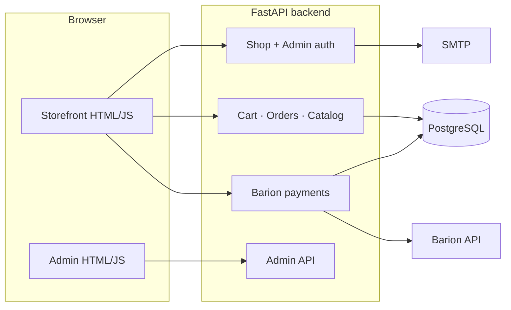

# Mesencsi — Portfolio Case Study

**Mesencsi** is a full-stack Hungarian children’s-book webshop: physical products, digital storybooks, gallery, and news — with verified customer accounts, server-side pricing, and **Barion** card payments.

| | |
|---|---|
| **Role** | End-to-end product engineering (backend, frontend, payments, admin, QA) |
| **Status** | Pre-production — software complete; live SMTP, Barion sandbox sign-off, and owner QA documented as launch gates |
| **Stack** | FastAPI · PostgreSQL · static HTML/JS · Barion · Playwright |
| **Locale** | Hungarian UI and validation (HU addresses, phone, copy) |

---

## Problem & solution

Small publishers need more than a template shop: verified buyers, combo discounts, digital storybooks with a custom reader, and payment flows that survive cancel/retry without losing the cart.

Mesencsi delivers a **single-origin** deployment (API + storefront + admin from one FastAPI app), **server-authoritative pricing** (coupons and bundle rules computed on the backend), and **payment hardening** (Barion `GetPaymentState` as source of truth, idempotent IPN, payment-attempt history).

---

## Architecture



**Design choices worth highlighting**

- **No SPA framework** — modular vanilla JS (`frontend/js/*`) with a thin composition root (`app.js`); fast to host, easy to reason about for a content-heavy shop.
- **Separate JWT secrets** for shop users vs admin; CSRF double-submit on mutating routes; rate limits on auth and checkout.
- **Cart persistence** on the server per user (`UserCartItem`); clears only when payment is **confirmed paid**, not on order creation or cancelled Barion sessions.
- **24 Alembic migrations** including payment attempts, bundle discounts, password reset tokens, and user cart tables.

---

## Feature map

| Area | Highlights |
|------|------------|
| **Shop** | Registration, email verification, profile (avatar, HU shipping/billing), webshop, cart FAB, checkout with server estimate |
| **Payments** | Barion sandbox/production, return URL sync, IPN, retry/resume guards, confirmation email hook |
| **Storybooks** | Admin canvas editor (layout, drag text, publish); public **Reader V2** (spreads, page-turn, reduced motion) |
| **Gallery & news** | Public grid + lightbox; featured news on home; comments for verified users |
| **Admin** | Owner vs maintenance roles; orders, products, bundles, gallery, news, storybooks, users/discounts (searchable user picker) |
| **Security** | Production CSP, secure cookies, OpenAPI disabled in prod, startup config validator |

---

## Engineering highlights (recent work)

### Commerce & cart correctness

- **Cart clears only on confirmed `paid` status** — not when starting Barion or on pending/cancelled return (regression tests in `tests/test_cart_clear_on_payment.py`).
- Server-side cart survives refresh and login; combo/coupon pricing always from `/orders/estimate` and checkout POST.

### Auth & account UX

- Forgot-password + reset-token flow (migration `024`).
- **In-profile password change** (`POST /auth/change-password`) behind a collapsible “Jelszó módosítása” panel — no SMTP required for day-to-day password updates.
- Login by **email** (not username); emails stored **lowercase**, login case-insensitive.
- JWT **`token_version`** — password reset / ban invalidates existing sessions.
- Dev helpers for verify/throttle reset without sending mail.

### Production hardening (2026)

- Barion **full checkout group** validation on payment start (409 on partial group).
- **Email outbox** for payment confirmations + cron worker (`process_email_outbox.py`).
- **Order idempotency** via `Idempotency-Key` header.
- Admin **owner-only** sensitive routes (verify/ban/delete users, payment_status).
- Production **startup validator** (secrets, bcrypt, HTTPS, SMTP).
- Alembic head **`029`**; `requirements-prod.txt` lock; `predeploy_alembic_check.py`.

### Admin & readability

- Users list above discount panel; assign coupons by name/email search.
- Clean-code readability pass (R1–R4): section markers, safe helpers (`sbBuildPagePatchFromForm`, `runV2SpreadRender`), no payment/auth logic drift.
- Shared notify/toast patterns on shop; admin boot/auth redirect fixes.

### Quality gates

| Layer | Scope |
|-------|--------|
| **Pytest** | **~300** tests (SQLite in-memory; optional Postgres alembic smoke) |
| **Playwright** | 5 specs — public, auth, shop/cart, content, admin |
| **Manual QA** | Structured checklists: public, admin, reader, gallery, Barion matrix, production readiness |

Gate scripts: `backend/scripts/gate_pytest.ps1`, `gate_full.ps1` (pytest + E2E).

---

## Tech stack

| Layer | Technologies |
|-------|----------------|
| Backend | Python 3, FastAPI, Uvicorn, SQLAlchemy 2, Alembic, Pydantic, PyJWT, bcrypt, slowapi |
| Database | PostgreSQL 16 (Docker Compose dev); SQLite for unit tests |
| Frontend | HTML5, CSS3, vanilla JS modules, password-toggle, client-side routing |
| Payments | Barion REST (Payment/Start, GetPaymentState, IPN) + dev stub mode |
| Email | SMTP (Mailpit local; production via env) |
| E2E | Playwright, cookie-based shop/admin auth in global setup |
| Ops | Docker Compose, `.env` + startup validator, security headers, CORS, health/metrics hooks |

---

## Repository layout

```
project/
├── PORTFOLIO.md          ← this file
├── HANDOVER.md           ← technical handover (English)
├── PROJECT_CONTINUATION.md
├── REVIEW_CHECKLIST.md
├── E2E_TESTING.md
├── BARION_SANDBOX_TESTING.md
├── backend/              ← FastAPI app, alembic, tests, scripts
├── frontend/             ← storefront + admin static assets
└── e2e/                  ← Playwright
```

---

## How to run (demo)

```powershell
cd backend
copy .env.example .env
# Set POSTGRES_*, USER_JWT_SECRET, ADMIN_JWT_SECRET, OWNER_* (see .env.example)

docker compose up -d          # Postgres + Mailpit (optional)
.\run.bat
```

| URL | Purpose |
|-----|---------|
| http://127.0.0.1:8000/ | Storefront |
| http://127.0.0.1:8000/admin/login | Admin |
| http://127.0.0.1:8000/docs | OpenAPI (dev only) |
| http://127.0.0.1:8000/health | Health check |

**Automated checks**

```powershell
cd backend
.\scripts\gate_pytest.ps1

cd ..\e2e
npm install && npm run install:browsers
npm test                    # backend must be running
```

---

## Production readiness (honest scope)

Software is **GO WITH CONDITIONS** ([GRAPH_ID_STATUS.md](GRAPH_ID_STATUS.md)): strong automated coverage and documented deploy checklist; launch still depends on:

- Live **SMTP** (verification, reset, payment confirmation)
- **Barion** sandbox/production sign-off (B1–B7 matrix)
- Owner **manual QA** on staging with `MESENCSI_PRODUCTION=true`
- Media persistence strategy if not using local disk

This is appropriate for a portfolio narrative: *built for production*, with explicit external gates rather than an undocumented “vibes-based” launch.

---

## Deeper documentation

| Document | Audience |
|----------|----------|
| [HANDOVER.md](HANDOVER.md) | Reviewers, new developers |
| [PROJECT_CONTINUATION.md](PROJECT_CONTINUATION.md) | Current sprint state |
| [REVIEW_CHECKLIST.md](REVIEW_CHECKLIST.md) | Acceptance testing |
| [backend/docs/deploy_readiness.md](backend/docs/deploy_readiness.md) | Production env |
| [backend/docs/pre_production_qa.md](backend/docs/pre_production_qa.md) | Full QA scope |
| [BARION_SANDBOX_TESTING.md](BARION_SANDBOX_TESTING.md) | Payment test matrix |
| [E2E_TESTING.md](E2E_TESTING.md) | Playwright setup |

---

## Portfolio talking points (elevator bullets)

1. **Full-stack commerce** for a real domain (children’s books + digital storybooks), not a generic todo app.
2. **Payment integration done properly** — Barion sync, IPN auth, idempotency, cart retention on cancel, admin cannot fake “paid”.
3. **Test pyramid** — 265+ pytest cases including payment hardening; Playwright smoke; manual QA playbooks.
4. **UX depth** — storybook reader V2, gallery lightbox, HU validation, admin editor, accessible password flows.
5. **Ops-aware** — production config validator, security headers, rate limits, separate admin/shop auth, documented blockers.

---

*Last updated: June 2026 — reflects cart-on-paid fix, profile password change, admin users/discounts UX, and post-readability-pass QA.*
